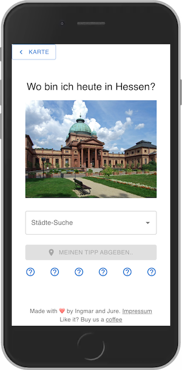

# A clone of the wordle app for cities in Hessen
With the app, for each day, you can guess in which city you are and share the results

Screenshot is displayed below: 

# Installation
It is a react app, so `npm install` and `npm start` works fine. Use https, if you want to use the share feature on mobiles: `HTTPS=true npm start`

# Customization
If you like to use this with other cities or regions, customize the `./public/cities.json` file with respective names, images and GPS coordinates.

# Demo
Installation available on https://hessenle.de

# Data used
City list from [Hessen City List](https://innen.hessen.de/sites/innen.hessen.de/files/2021-06/tabelle_hessische_staedte191.pdf) and images from Wikipedia.

# Impressum for hessenle.de
Jure Zakotnik, Vorderstrasse 10, 61462 Königstein
info@hessenle.de

